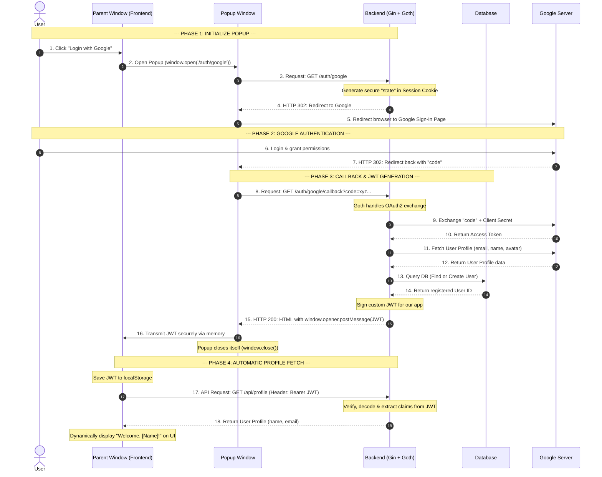

```mermaid
sequenceDiagram
    autonumber
    actor User as User
    participant Parent as Parent Window (Frontend)
    participant Popup as Popup Window
    participant BE as Backend (Gin + Goth)
    participant DB as Database
    participant Google as Google Server

    %% Phase 1
    Note over User, BE: --- PHASE 1: INITIALIZE POPUP ---
    User->>Parent: 1. Click "Login with Google"
    Parent->>Popup: 2. Open Popup (window.open('/auth/google'))
    Popup->>BE: 3. Request: GET /auth/google
    Note over BE: Generate secure "state" in Session Cookie
    BE-->>Popup: 4. HTTP 302: Redirect to Google
    Popup->>Google: 5. Redirect browser to Google Sign-In Page

    %% Phase 2
    Note over User, Google: --- PHASE 2: GOOGLE AUTHENTICATION ---
    User->>Google: 6. Login & grant permissions
    Google-->>Popup: 7. HTTP 302: Redirect back with "code"

    %% Phase 3
    Note over Popup, DB: --- PHASE 3: CALLBACK & JWT GENERATION ---
    Popup->>BE: 8. Request: GET /auth/google/callback?code=xyz...
    Note over BE: Goth handles OAuth2 exchange
    BE->>Google: 9. Exchange "code" + Client Secret
    Google-->>BE: 10. Return Access Token
    BE->>Google: 11. Fetch User Profile (email, name, avatar)
    Google-->>BE: 12. Return User Profile data
    BE->>DB: 13. Query DB (Find or Create User)
    DB-->>BE: 14. Return registered User ID
    Note over BE: Sign custom JWT for our app
    BE-->>Popup: 15. HTTP 200: HTML with window.opener.postMessage(JWT)
    Popup->>Parent: 16. Transmit JWT securely via memory
    Note over Popup: Popup closes itself (window.close())

    %% Phase 4
    Note over Parent, BE: --- PHASE 4: AUTOMATIC PROFILE FETCH ---
    Note over Parent: Save JWT to localStorage
    Parent->>BE: 17. API Request: GET /api/profile (Header: Bearer JWT)
    Note over BE: Verify, decode & extract claims from JWT
    BE-->>Parent: 18. Return User Profile (name, email)
    Note over Parent: Dynamically display "Welcome, [Name]!" on UI
```
