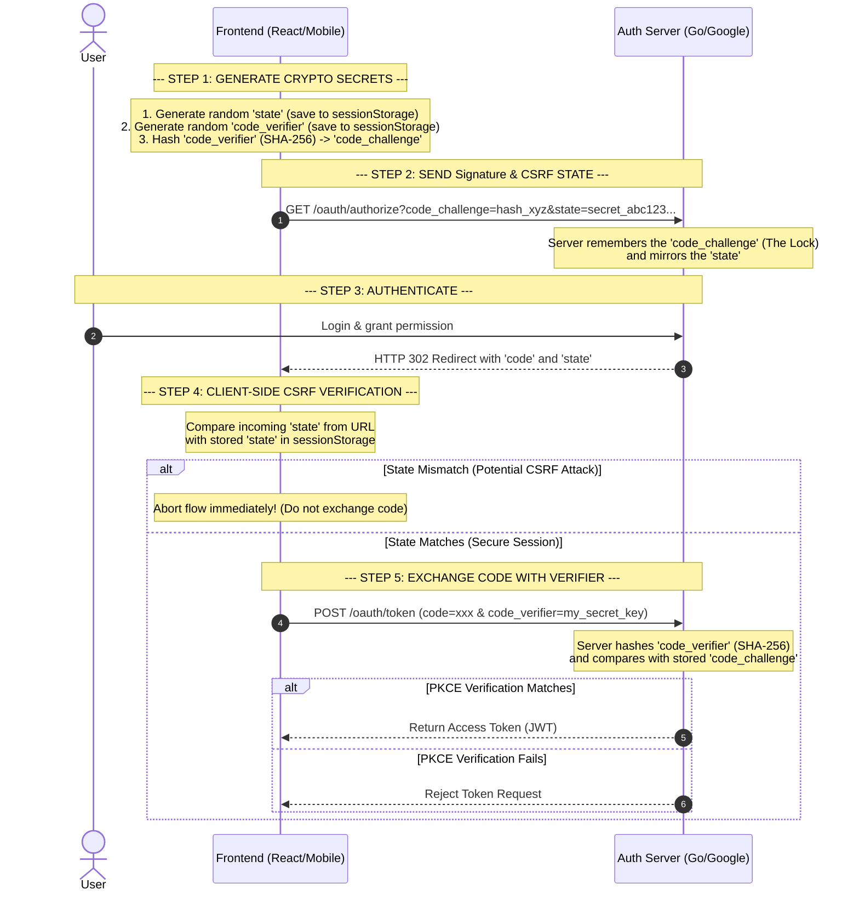

# Why need oauth 2

- Want Social Login (google, facebook, github, etc) -> Let Other Provider authorized our app to access user data
- Develop ecosystem (Google, Facebook, Github, etc) -> Provide OAuth 2.0 to let other app access user data

## Why Oauth + Proof Key for Code Exchange (PKCE) - Pronunciation: "pixie"

- Mitigate the risk of having the authorization code intercepted by a malicious app

- state: avoid CSRF attack, but not enough to prevent code interception. force full flow is send from one user.
- code_challenge + code_verifier: (Commitment Scheme) (Challenge - Response mechanism)
  - code_verifier: (or secret) generated by client and send to authorization server.
  - code_challenge: (lock) generated by client and send to authorization server with challenge_method (hash_method).
  - AuthServer: will verify code_verifier with code_challenge when client exchange token pairs.
- authCode: generated by the authorization server return to client. Client use this code to exchange token pairs.

## Public Client (Unauthenticated Client)

- Vue, React, Mobile, SPA, etc. (No Client Secret) -> Cause reverse client code can get `client_secret`.

## Confidential Client

- Server, Backend, etc. (With Client Secret) -> Can store `client_secret` in server side (in environment variable, config file, etc.) and not expose to public.

## OAuth 2.0 + PKCE Flow

