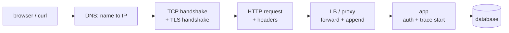

# Request Journey

**TL;DR:** Client intent crosses DNS, TCP, TLS, HTTP, LB, app, DB — each hop adds headers/IDs. Trace the whole path with one trace ID.

Keywords: DNS, handshake, headers, propagation, tail latency.

## Per-hop additions

| Hop      | Adds / decides                    | Headers in play                                                    |
| -------- | --------------------------------- | ------------------------------------------------------------------ |
| DNS      | IP, TTL, resolver latency         | — (DoH: `Accept: application/dns-json`)                            |
| TCP      | Connection, keep-alive reuse      | `Connection`                                                       |
| TLS      | Identity (cert), ALPN picks h1/h2 | — (handshake, no HTTP headers yet)                                 |
| HTTP     | Method, path, content deal        | `Host`, `Content-Type`, `Accept`, `Authorization`, `Cache-Control` |
| LB/proxy | `X-Forwarded-*`, hop count        | `X-Forwarded-For`, `X-Request-ID` (generate if absent), `Via`      |
| App      | Auth principal, trace span        | `traceparent` (W3C), baggage, tenant claims                        |
| DB       | Row data (or RLS-filtered rows)   | — (wire protocol, not HTTP)                                        |

## IDs that stitch the journey

- **`X-Request-ID`**: one ID per request, generated at edge if missing.
  Join logs across services by it. Cheap, no standard semantics.
- **W3C `traceparent`**: `version-traceID-spanID-flags`. Real distributed
  tracing (OpenTelemetry): one trace, many spans, tail-latency analysis.
- **Tenant IDs**: business scope, not transport. Travel in JWT claims
  (see storage labs), never trust client-supplied values.
- Rule: generate at edge, propagate everywhere, log everywhere.

## Where it breaks (preview of later docs)

- Missing `X-Request-ID` → multi-service debugging by timestamp guessing.
- CORS preflight failing on custom headers (`Prefer`, `Authorization`).
- Proxy buffering long-lived streams (SSE) or stripping headers.
- TLS/ALPN mismatch silently downgrading HTTP/2 → HTTP/1.1.
