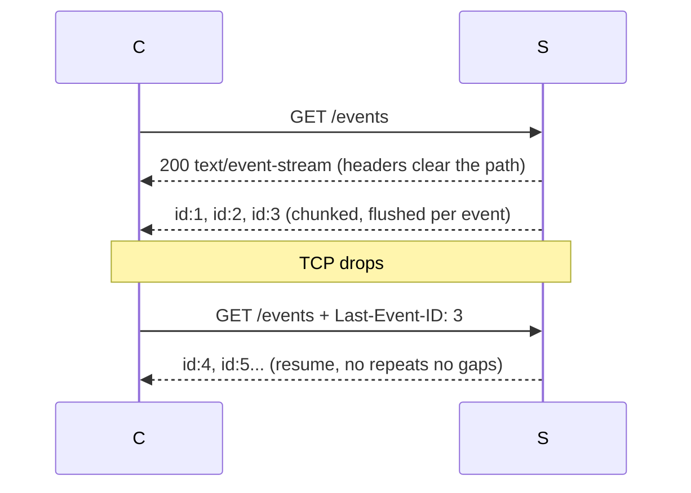

# SSE basics — HTTP that never finishes

> TL;DR: **one TCP**, **one request/response**, **one socket**. The response
> carries stream headers and the server **never closes** it — data
> drips down in **chunks** forever.

## 1. Wire format (server → client only)

```text
id: 42
event: tick
data: {"n":42}

: heartbeat (client ignores it)

retry: 3000
data: multi
data: line two
```

- Blank line = dispatch. `data:` lines join with `\n`.
- `id:` → resume cursor. `event:` → type. `retry:` → reconnect delay.
- Client talks back via separate POST/fetch. No upstream channel.

## 2. Headers (each earns its place)

```text
Content-Type: text/event-stream
Cache-Control: no-cache
Connection: keep-alive
X-Accel-Buffering: no
Access-Control-Allow-Origin  <- EventSource obeys CORS
```

- **`text/event-stream`**: the switch routing the body to the
  EventSource parser. Wrong MIME → `error` + reconnect loop,
  zero events dispatched.
- **`no-cache`**: response never ends — must never be stored.
  Cached first chunk would replay stale/truncated bytes to the
  next subscriber.
- **`keep-alive`** + `: heartbeat`: socket lives for minutes.
  Defeats middleboxes that cut "idle" connections.
- **`X-Accel-Buffering: no`**: nginx buffers full responses by
  default — for infinite streams the buffer never fills, client
  starves forever. This header disables buffering per response
  (alt: `proxy_buffering off` in conf). Flush two layers: nginx
  (header) + app (`Flush()` per event). Miss one, events stall.
- No `Content-Length` on purpose → `chunked` encoding, each flush
  parses immediately.

## 3. Resume contract



Same idea as our realtime lab: cursor over a log, not re-subscription.

## 4. Limits

- Text only (binary → base64).
- Auth: cookies same-origin; cross-origin needs CORS +
  `withCredentials`. Query-param tokens leak into logs — keep
  them short-lived.

### 6 connections per origin (HTTP/1.1)

- Browser policy, not physics: max 6 parallel TCP connections
  per origin (RFC 2616 once said 2; browsers settled on 6 —
  fast enough to load, polite enough not to hammer).
- HTTP/1.1 = 1 connection carries 1 request/response at a time.
  Normal requests finish in ms and free the slot; SSE never
  finishes — each stream holds one slot forever.
- 6 open streams → pool full → request #7 queues **inside the
  browser** (no SYN on the wire, server never sees it) until a
  slot frees. Rule: one stream per page, multiplex topics via
  `event:` names. HTTP/2 multiplexing retires this whole issue.
- Prove it: `web/slots.html` → Open 7 → #7 sticks at
  `CONNECTING...` (pending in Network tab); Close all frees it.
- Pool is **browser-wide per origin**, not per tab: 10 tabs of
  one dashboard share the same 6 slots. Heavy apps use one
  SharedWorker stream feeding all tabs.

### Sockets are the real budget

- 1 TCP connection = 1 socket per endpoint. 6 streams = 6
  client sockets + 6 server sockets, held forever.
- Sockets are finite OS resources (file descriptor + buffers +
  a Go goroutine each). Default `ulimit -n` (~1024) caps streams
  long before CPU runs out — scaling SSE is the C10K game:
  raise FD limits, tune `sysctl`, bound per-connection memory.

### Traps

- **HTTP errors kill retry.** Network drop → browser reconnects.
  But 4xx/5xx status → EventSource gives up, no retry. To force
  a client-side retry, close the connection silently (like our
  `?kill_after`) instead of returning an error status.
- **No custom headers.** `new EventSource(url)` sets no
  `Authorization`. Auth rides cookies (same-origin) or query
  params (leak into logs — short-lived only). Cross-origin
  cookies need CORS + `withCredentials`.
- **LB idle timeouts.** Balancers cut "quiet" connections
  (default ~60s) even when the stream is healthy. Heartbeat
  `:` comments every ~30s are mandatory behind LB/proxy.
- **Detect dead clients.** Closed tabs leave the server writing
  into the void (goroutine/RAM leak). Watch the request context
  (`r.Context().Done()` in Go) and return.
