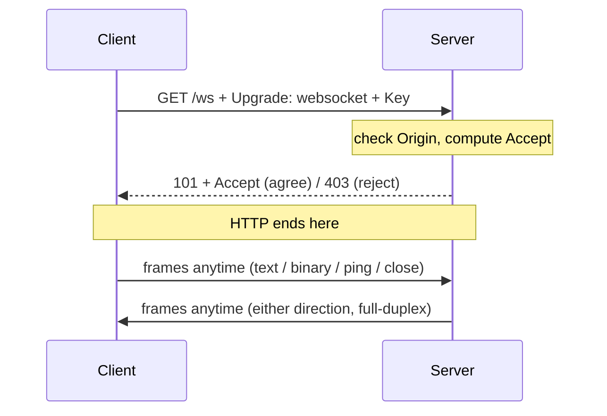

# WebSocket Basics

**TL;DR:** Handshake (HTTP upgrade + key challenge) → frames (opcode + masked payload) → ping/pong + close codes. Relearn in this order.

Keywords: handshake, masking, opcodes, control frames.

## 1. Handshake detail



```text
Client → GET /ws
         Upgrade: websocket
         Connection: Upgrade
         Sec-WebSocket-Key: <base64-nonce>
         Sec-WebSocket-Version: 13

Server → 101 Switching Protocols
         Sec-WebSocket-Accept: s3pPLMBiTxaQ9kYGzzhZRbK+xOo=
```

- `Accept` = `base64(sha1(key + "258EAFA5-E914-47DA-95CA-C5AB0DC85B11"))`.
  Proves the server speaks WebSocket (not a blind TCP echo).
- Exactly one way, hardcoded in RFC 6455: no negotiation, every
  implementation computes identically. Client re-verifies, mismatch drops.
- After 101: HTTP ends. Same TCP, new protocol.

## 2. Frames (what actually flies)

```
 0                   1                   2                   3
 0 1 2 3 4 5 6 7 8 9 0 1 2 3 4 5 6 7 8 9 0 1 2 3 4 5 6 7 8 9 0 1
+-+-+-+-+-------+-+-------------+-------------------------------+
|F|R|R|R| opcode|M| Payload len |    Extended payload length    |
|I|S|S|S|  (4)  |A|     (7)     |             (16/64)           |
|N|V|V|V|       |S|             |                               |
| |1|2|3|       |K|             |                               |
+-+-+-+-+-------+-+-------------+ - - - - - - - - - - - - - - - +
```

- **opcode**: `0x0` continuation, `0x1` text, `0x2` binary, `0x8` close, `0x9` ping, `0xA` pong.
- **MASK bit**: client→server MUST be masked (4-byte key XOR), server→client MUST NOT. Anti-cache-poisoning relic, non-negotiable.
- Overhead: 2 bytes minimum (vs ~500B+ HTTP headers per message).

## Frame parts, complete (7 fields)

1. **FIN** (1 bit) — last frame of the message? (fragmentation).
2. **RSV1-3** (3 bits) — reserved, usually 0 (extensions like compression use them).
3. **Opcode** (4 bits) — action: text/binary/close/ping/pong/continuation.
4. **MASK bit** (1 bit) — flag only, not random. Client→server always 1.
5. **Payload len** (7 bits, +16/64 extended when large) — the ruler.
6. **Masking key** (4 bytes, only when MASK=1) — random per frame. This is the random part, not the bit.
7. **Payload** — data (XORed with key when masked).

## Frame bytes, decoded by hand

Client sends `"Hi"` (masked, as required):

```text
0x81 0x82 0x12 0x34 0x56 0x78 0x5A 0x5D
|     |    \____ ____/  \__ __/
|     |         |          └─ payload XOR mask = "Hi"
|     |         └─ 4-byte mask key (random per frame)
|     └─ MASK=1, len=2
└─ FIN=1, opcode=0x1 (text)
```

- Decode: `0x5A^0x12='H'`, `0x5D^0x34='i'`.
- XOR round-trips: `"Hi"` leaves as masked bytes, XOR with the same
  key returns raw value. Masking is obfuscation, not encryption —
  anyone holding the frame (key travels inside it) decodes instantly.
- Server echo of `"Hi"` (never masked): `0x81 0x02 0x48 0x69`
  (`H`=0x48, `i`=0x69 raw). Compare lengths: masked costs +4 bytes.
- Longer payloads: len `126` → next 2 bytes are real length;
  `127` → next 8 bytes. Same frame shape, bigger ruler.

## 3. Control frames

- **ping/pong**: keepalive + latency probe. Either side sends ping, other auto-pongs (gorilla handles pong internally).
- **close**: code + reason (`1000` normal, `1001` going away, `1006` abnormal = never on wire, local only).
- Control frames max 125 bytes payload, never fragmented.

## 4. Fragmentation

- Big messages split into `opcode` + `0x0` continuations + `FIN` bit on last.
- Library reassembles (`ReadMessage` returns whole); raw implementers must buffer.

## Lab order from here

1. Handshake inspect: curl `-i` upgrade, compute Accept by hand once.
2. Masking: capture client frame bytes, XOR-decode manually once.
3. Ping/pong + close codes in browser DevTools (WS frames tab).
4. Then back to code: heartbeat, reconnect backoff, broadcast fan-out.
