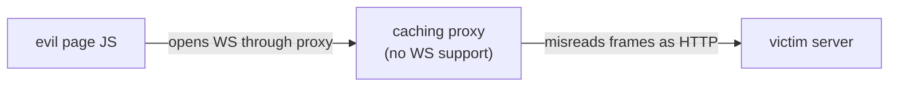

# Why Masking Exists

**TL;DR:** Masking stops attacker JavaScript from putting chosen bytes on the wire through confused middleboxes. Obfuscation, not encryption.

Keywords: cache poisoning, confused deputy, unpredictability.

## The attack (without masking)

1. Victim visits evil page. JS opens WebSocket through a transparent caching proxy that doesn't understand WS frames.
2. JS crafts payload bytes looking like an HTTP response: `HTTP/1.1 200 OK... `.
3. Proxy mistakes WS frames for HTTP, caches the fake response under a real URL.
4. Later victims requesting that URL get the poisoned cache. Game over.

## The defense (masking)

- Every client→server frame carries a **random 4-byte mask** chosen by the **browser**, invisible and uncontrollable to page JS.
- Payload on wire = `data XOR key`. Attacker knows the data but never the key → cannot arrange target bytes.
- Proxy sees unpredictable bytes → nothing parseable as HTTP → nothing cached.
- Server strips the mask (XOR again) and processes normally.

## What masking is NOT

- Not encryption: key travels inside the frame, anyone holding bytes decodes instantly.
- Not authentication: proves nothing about who sent it.
- Server→client needs none: servers are trusted, no attacker script runs there.
- Rule: unmasked client frame → server MUST drop the connection. Non-negotiable per RFC 6455.

## Attacker self-masking changes nothing

- Page JS has no API to send raw frames or choose the mask. It hands
  payload bytes to the browser; the browser masks last with its own key.
- Attacker pre-XORing with a personal key only adds one unknown layer
  under the browser's unknown layer: `wire = attackerBytes XOR browserKey`.
- Final bytes stay unpredictable. The last XOR always belongs to the
  trusted party (browser), never the page script.
