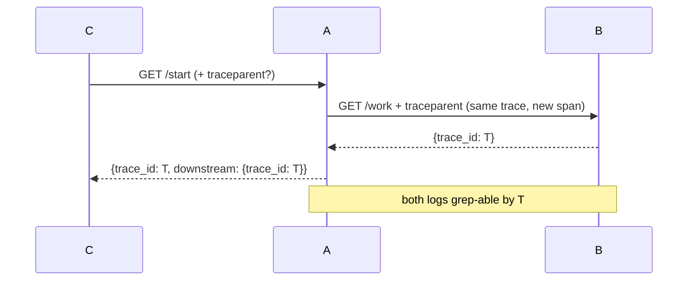

# Trace propagation — one ID, every hop

> TL;DR: **trace ID** is shared end to end, **span ID** is new per
> hop. `traceparent` carries both in **one header**; corrupt or
> absent → **start fresh**, never fail the request.



## 1. Header anatomy (W3C trace-context)

```text
traceparent: 00-<trace-id>-<parent-id>-<flags>
             │   32 hex      16 hex      01 = sampled
             └── version 00
```

- **trace-id**: minted once at the edge, immutable downstream.
- **parent-id**: this hop's span; each service mints a child
  span for the next call (`Child()` keeps trace, renews span).
- Malformed/absent → new trace. Propagation is best-effort
  decoration, never a gate.

## 2. Rules

- Read on entry, write on exit (every outbound call forwards).
- Log `trace_id` on every line that matters — correlation is
  `grep <T>` across services, no collector needed for the demo.
- Async work (queues, cron) carries the context in the message
  envelope — headers only survive HTTP hops.
- Production: forward to a collector (OTel SDK, Jaeger/Tempo);
  the header contract stays identical, only the sink changes.
