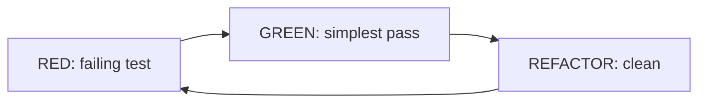

# TDD — test first, design follows

> TL;DR: write a **failing test** for one behavior, write the
> **simplest code** that passes, **refactor**. Deep-dive lives
> in the author's post below — this note keeps only the
> repo-grounded rules.

Canonical read: [Go Testing Demystified — techniques, tools and
TDD (unit-test focused)](https://medium.com/@ductran999/go-testing-demystified-techniques-tools-and-test-driven-development-unit-test-focused-b3e579c6d5bb)

## Rules applied in this repo

- `storage/rls` usecase tests: **hand-written stubs**, no mock
  frameworks; table-driven cases; `usecase` 100%.
- Test the **boundary** (status + body, behavior in/out), never
  internals (call counts, SQL strings, private methods).
- One behavior per test; `Given_When_Then` names.
- Keep the loop instant: the tested package's suite must run in
  under a minute or the cycle dies.
- Throwaway spikes are fine — pin behavior with tests **before
  merging** (spike-and-stabilize).
