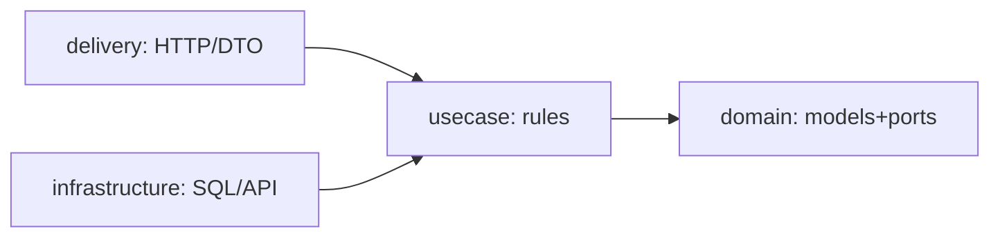

# Clean architecture — dependencies point inward

> TL;DR: **domain** knows nothing, **usecase** orchestrates,
> **infrastructure** implements, **delivery** translates.
> Dependencies point **inward**; `New` wires outward at the edge.

Grounded in `storage/rls`: `domain/document.go` (models + repo
ports), `usecase/report.go` (rules, 100% tested on stubs),
`infrastructure/{scoped,rls}/repository.go` (GORM vs RLS SQL),
`delivery/http.go` (gin + DTO), `bootstrap/postgres.go` (wiring).

## 1. Rules

- Domain has zero imports outside stdlib. Ports (interfaces)
  live beside the models they serve — usecase defines what it
  needs, infrastructure conforms.
- Usecase takes interfaces, never constructors of adapters.
  Test with hand-written stubs (see `02-tdd.md`).
- Delivery owns DTOs + mapping, never business decisions.
  One DTO change must not ripple into usecase.
- `main`/`bootstrap` is the only place that knows concrete
  types (composition root). Constructors return concrete structs
  (`ireturn`), callers bind narrow interfaces.

## 2. When to bend it

- Single-adapter CRUD with no rules → usecase is a pass-through;
  keep the shape (cheap), skip the ceremony (no empty layers).
- Spikes/prototypes → flat first, extract inward when the
  second adapter or first rule appears.
- Never invert: infrastructure importing usecase concrete types,
  domain importing drivers. That direction is the whole game.
