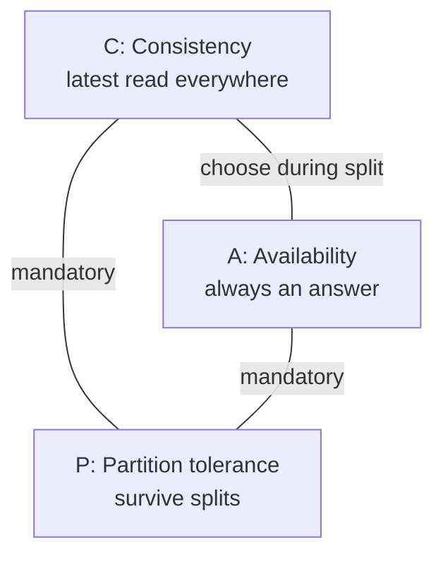

# CAP theorem — pick your failure mode

> TL;DR: partitions **will** happen (P is mandatory). Then choose:
> **refuse** (CP) or **answer stale** (AP). Every database is one
> sentence on this triangle.

## Why P is inevitable

Splits are not just cut cables: dead switches, bad firewall pushes,
expired certs, AZ outages — and **slow links past timeouts** (a late
node counts as a split). Any network fails eventually, so every
serious store implements P. The theorem collapses to CP vs AP.

## CP vs AP in practice

|              | CP (refuse)                                    | AP (answer stale)                                     |
| ------------ | ---------------------------------------------- | ----------------------------------------------------- |
| During split | Minority side errors                           | All sides answer, may disagree                        |
| After heal   | Nothing to repair (never diverged)             | **Repair needed**: read-repair, hinted handoff, CRDTs |
| Examples     | Postgres single-master writes, etcd, ZooKeeper | Cassandra, DynamoDB, DNS                              |
| Feels like   | "writes stopped, data safe"                    | "always up, sometimes stale"                          |

## The dial, not the dogma

- Pure CP/AP are endpoints; real systems slide: Cassandra
  `ONE → QUORUM → ALL` walks AP→CP per query.
- Ask of any database: "what happens on a split, and how does it
  heal?" — the answer places it on the triangle.

## Glossary (words that recur)

| Word                     | Means                              | Example                                                           |
| ------------------------ | ---------------------------------- | ----------------------------------------------------------------- |
| inevitable (unavoidable) | will happen, can't prevent         | Partitions are inevitable — plan for them                         |
| mandatory (must-have)    | required, no choice                | P is mandatory, so the choice is CP vs AP                         |
| diverged (drifted apart) | nodes disagree after a split       | Diverged replicas need repair on heal (read-repair, hints)        |
| stale                    | old, not latest                    | AP reads may return stale data                                    |
| dogma                    | rigid doctrine, no questions asked | "The dial, not the dogma": tune per query, don't worship CP or AP |
