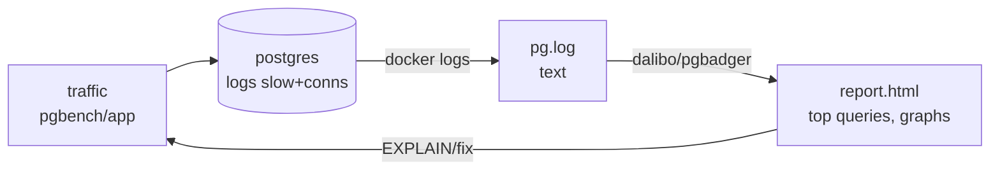

# pgbadger — read the logs, find the slow

> TL;DR: log **slow + connects** (`log_min_duration_statement`,
> `log_connections`), generate load, render HTML, fix top queries,
> repeat. Logs are the cheapest profiler you already pay for.



## 1. What to log (and cost)

| Setting                              | Captures                                    | Cost                           |
| ------------------------------------ | ------------------------------------------- | ------------------------------ |
| `log_min_duration_statement = 500`   | Queries slower than 500ms + duration        | Tiny (slow only)               |
| `log_connections/disconnections`     | Who connects, pool churn visible            | Small                          |
| `log_line_prefix = '%t [%p] %u@%d '` | Who/what per line (needed for attribution!) | Free                           |
| `log_statement = 'all'`              | **Everything**                              | Heavy — debug only, never prod |

- Our pgbouncer `postgresql.conf` ships the first two. Default
  prefix works; `%u@%d %a` makes per-app attribution possible.

## 2. Reading the report

- **Top queries by total time** (not count!): 1 slow query × 1000
  beats 1000 fast ones. Fix by total, not frequency.
- **Checkpoints + WAL**: write storms show here, not in slow log.
- **Connections histogram**: churn (connect/disconnect storm) =
  pool misconfigured — cross-check with pgbouncer `SHOW POOLS`.
- **Errors**: `53300 too many clients` spikes timestamped against
  deploys = max_connections story with evidence.

## 3. The loop

```text
bench/load → logs → pgbadger → top query → EXPLAIN → index/fix
→ re-bench → compare reports (pgbadger diffs two runs)
```

- Keep reports per run (`report-01.html`): progress is a diff,
  not a feeling.
- Tune one thing at a time or the diff lies.

## 4. Live vs forensic (two tiers)

- **Live (alarm)**: GORM logger `SlowThreshold` (>200ms logs SQL +
  duration + trace immediately), `pg_stat_statements` top realtime.
- **Forensic (autopsy)**: pgbadger on collected logs — patterns by
  total time, hours, checkpoints. Batch by design (incremental mode
  exists, still reads-after).
- pgbadger never watches live: slow query? threshold logs tell you
  now; pgbadger tells you why, later.

## 5. Full detection chain (slow-query observability)

```text
GORM SlowThreshold ──alarm──→ log line (SQL + 800ms + trace.id)
        │                                │
        │                         OTel span (db.statement,
        │                         duration, tenant.id) → Jaeger waterfall
        v                                v
pg_stat_statements ──live top──→ which query family is hot NOW
        │
pg logs ──forensic──→ pgbadger report: top by TOTAL time, hours,
                      checkpoints, errors → EXPLAIN → fix → re-bench
```

- **Alarm** (GORM): *a* query is slow, right now, with its trace.
- **Locate** (OTel/Jaeger): *where* in the journey (which service,
  before/after what) via trace.id.
- **Explain** (pgbadger + EXPLAIN): *why* (plan? lock? checkpoint?)
  and *how much* in aggregate.
- Three tools, one flow: alarm → locate → explain → fix.
