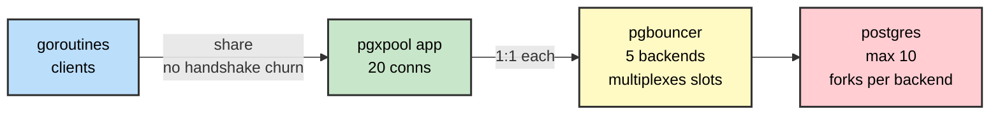

# Pooling — Postgres forks per connection, poolers don't

> TL;DR: Postgres **forks a process per connection** (~10MB each,
> max_connections wall). pgbouncer multiplexes **many clients →
> few server conns**. Point apps at `:6432`, never `:5435`.



## 1. Why

- 200 app conns direct = 200 backends ≈ 2GB RAM + fork storms.
  Same 200 through the pool = 20 server conns, rest wait fairly.
- Connection setup (fork + auth + TLS) costs ms each: pooled
  conns are warm, short queries skip the handshake tax.

## 2. Three modes (pick by workload)

| Mode          | Server conn held     | SET/transaction state | Use when                          |
| ------------- | -------------------- | --------------------- | --------------------------------- |
| `session`     | Whole client session | Safe (sticky)         | Long sessions, legacy apps        |
| `transaction` | Per transaction      | **Reset each tx**     | Stateless APIs (default pick)     |
| `statement`   | Per statement        | Nothing survives      | Autocommit single statements only |

## 3. What breaks (transaction mode gotchas)

- `SET LOCAL` / `SET` leaks? No — reset per tx, but **session-level
  SET vanishes**: our RLS lab's `SET LOCAL` inside explicit
  transactions still works; `SET` outside tx does not.
- Prepared statements: server-side `PREPARE` dies with the checkout
  → use `max_prepared_statements` or client-side prepares (pgx does).
- LISTEN/NOTIFY: needs a sticky conn — our realtime listener must
  bypass the pool (dedicated direct conn, as documented).
- Advisory locks: released at tx end — don't span transactions.

### SET vs SET LOCAL under the pool (`make setleak`)

Same server backend twice (pool max 1, PID proves it):

```text
== 1. plain SET ==
[checkout A] backend pid=123, myapp.tenant=<unset>
[checkout A] SET myapp.tenant='t1'
[checkout B] backend pid=123, myapp.tenant=t1   ← leaked across checkouts!
== 2. SET LOCAL ==
[tx] SET LOCAL myapp.tenant='t2', inside reads="t2"
[tx] COMMITTED
[checkout D] backend pid=123, myapp.tenant=<unset>  ← gone with the tx
```

- Plain `SET` writes **session** state: the backend keeps it after
  checkout, the next tenant on that backend inherits it. In a pool,
  "next on that backend" is a stranger → cross-tenant leak.
- `SET LOCAL` writes **transaction** state: visible inside the tx
  (`SHOW` reads `t2`), discarded at COMMIT. Each checkout starts
  blank — pool-safe by construction.
- Rule: tenant/role context in pooled mode is `SET LOCAL` inside an
  explicit transaction, always. Exactly what the RLS lab does.

## 4. Rules

- Pool size ≈ `(2 × CPU) + disks` for server conns; clients 10x that.
- One pool per role/db; `pool_mode` per workload, not per server.
- Bench it (`make bench`): direct collapses past ~100 conns,
  pooled stays flat — numbers beat theory.

## 5. PoC: app pool ≠ server pool (20 clients, 10 slots)

|              | Direct `:5435`                 | Pooled `:6432`              |
| ------------ | ------------------------------ | --------------------------- |
| Server conns | 10 (`max_connections`)         | **5** (`DEFAULT_POOL_SIZE`) |
| App clients  | 20                             | 20                          |
| Result       | Fails `53300 too many clients` | Passes clean                |
| Proved by    | `TestTooManyClients`           | `TestPooledSurvives`        |

- pgxpool multiplexes goroutines over _its own_ conns, but each
  pool conn still costs **one server backend**: 20 app conns need
  20 server slots, pool or not. App-side pooling saves handshake
  churn, never server slots.
- Only a server-side pooler (transaction mode) breaks the 1:1:
  5 backends serve 20 clients. Two pools, two jobs — stack them.
- HTTP `429` is the API layer's mapping of `53300`, not PG's doing.

## 6. Query protocols: simple vs extended (pgx defaults extended)

|          | Simple                                      | Extended                                  |
| -------- | ------------------------------------------- | ----------------------------------------- |
| Wire     | One string, many statements                 | `Parse/Bind/Describe/Execute`             |
| Params   | Interpolated (escape right or SQLi)         | Bound separately (immune by construction) |
| Plans    | Fresh custom plan every run                 | Custom ×5 → cached **generic** plan       |
| Prepare  | None (nothing to lose on checkout)          | Server-side PREPARE dies in tx mode       |
| pgx call | `QuerySimple`                               | Default queries                           |
| Use for  | Ad-hoc (one-off probe, migration, `LISTEN`) | Repeated OLTP                             |

- Ad-hoc = made up on the spot, run once (incident probe, manual
  fix). Fresh plan fits; no cache wasted on the unrepeatable.
- Rule: repeated OLTP → extended; ad-hoc/multi-statement → simple.
