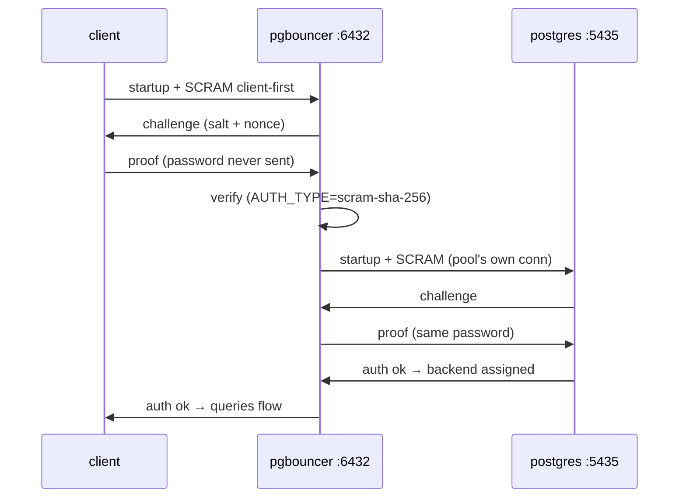

# Auth flow — client → pgbouncer → postgres (SCRAM twice)

> TL;DR: password **never travels**: two independent SCRAM
> handshakes (client↔pool, pool↔server). Same password both
> sides, `AUTH_TYPE` must match the server or everything 401s.

## 1. SCRAM in one paragraph

- **S**alted **C**hallenge **R**esponse **A**uth **M**echanism:
  server sends random challenge + salt, client answers with
  `H(password, salt, challenge)`. Eavesdropper learns nothing
  reusable; salt defeats rainbow tables.
- `SCRAM-SHA-256` is Postgres ≥14 default (MD5 before).
  pgbouncer `AUTH_TYPE` must say `scram-sha-256` or the pool
  speaks MD5 to a SCRAM server — right password, still denied.

## 2. Why twice

- pgbouncer terminates the client connection (it IS the server
  to the app) and opens its own to Postgres (it IS a client).
  Two TLS/auth boundaries → two handshakes, same secret.
- `auth_query` alternative: pool fetches hashes from Postgres
  instead of duplicating passwords in config — scales past a
  handful of users.
