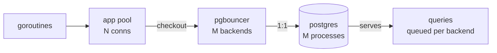
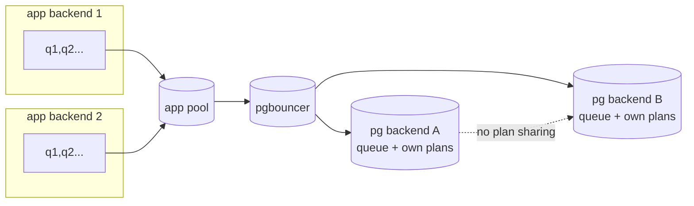

# Concepts — connection, process, backend, session

> TL;DR: 1 client connection = 1 socket pair. 1 server connection =
> 1 **backend process** (fork, ~10MB) serving **thousands of queries**
> in turn. Session = connection + state. Pools multiplex the mapping.

## Multiplexer vs multiplexing (don't mix them)

- **Multiplexer/mux** (`ServeMux`, chip mux): **1 → N** — one input,
  pick the outgoing route (request → handler).
- **Multiplexing** (pgbouncer, H2 streams): **N → 1** — many clients
  share one resource (backends, connection).
- Same root, opposite directions: mux *routes*, multiplexing *shares*.

```text
mux (1 → N, routes):            multiplexing (N → 1, shares):

  req /todos ──→ [H1]             c1 ──┐
  req /todos/42 ──→ [H2]          c2 ──┼──→ [backend pool: 5]
  req /files/ ──→ [H3]            c3 ──┘      (time-shared)
  1 request, pick 1 handler       200 clients, 5 backends take turns
```



| Term                | What                                      | Lives where            | Dies when                          |
| ------------------- | ----------------------------------------- | ---------------------- | ---------------------------------- |
| Client conn         | socket app→pool/DB                        | App FD + server socket | Close/checkout end                 |
| App pool conn       | slot in pgxpool/`sql.DB`                  | App RAM                | `MaxLifetime`/close                |
| Server conn/backend | forked process (~10MB)                    | Postgres               | Disconnect                         |
| Session             | conn + state (SET, temp, prepares, locks) | Backend memory         | Disconnect (or DISCARD on release) |
| Query               | one statement execution                   | Runs _on_ a backend    | Finishes in ms                     |
| Generic plan        | cached plan for a prepared stmt           | Backend memory         | Backend exits / DISCARD            |

State is **backend-local** (invisible across backends, wiped by
DISCARD); pooling changes ratios, never units.

## Backend lifetime (one process, sequential sessions)



## No result cache (correction)

| ✅ right                                             | ⚠️ fix                                                                            |
| ---------------------------------------------------- | --------------------------------------------------------------------------------- |
| 1 session, N queries queued; PREPAREd → Bind+Execute | Identical query **still executes**: PG has **no result cache**                    |
| 2nd run faster (plan + pages cached)                 | `shared_buffers` = **data pages**, not results; result cache lives in app (Redis) |

## TL;DR formula (repeat query cost)

```text
cost = Plan[0|1] + Exec[1] + Disk[0|1]

1st run:  Plan[1] + Exec[1] + Disk[1]   (parse, plan, read disk)
2nd same: Plan[0] + Exec[1] + Disk[0]   (prepared + pages cached)
                         ▲
                    always 1: PG has NO result cache.
```
