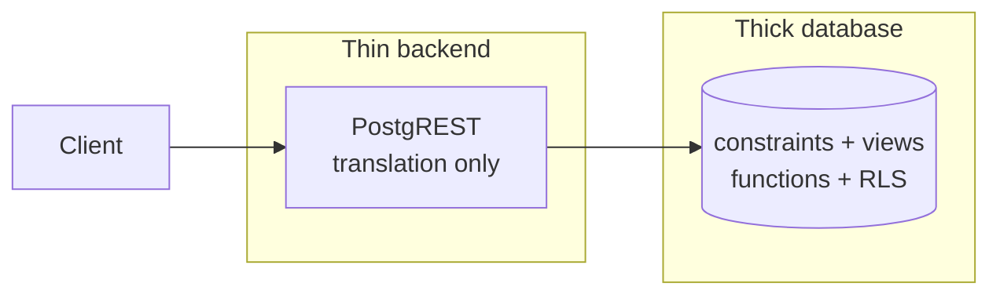

# PostgREST Basics

**TL;DR:** Postgres reflected as REST. Thick database, thin backend. URL → SQL → JSON.

Keywords: reflection, no controllers, schema as API.

## Concept: thick database, thin backend

> PostgREST = `translator`: REST (URL + headers) → SQL → Postgres → JSON

- Traditional: dumb DB (row store) + thick backend (all logic in app).
- PostgREST: logic in Postgres, backend = pure translation layer.



- Gain: single source of truth, near-zero boilerplate.
- Cost: logic in SQL — needs Postgres skills, not framework skills.

## Request flow


- Client never touches Postgres. URL → SQL → rows → JSON.

## Schema to API mapping

| Database | HTTP                                        |
| -------- | ------------------------------------------- |
| Schema   | Namespace (`/`, gated by `PGRST_DB_SCHEMA`) |
| Table    | Collection (`/todos`)                       |
| Row      | Item (via filter)                           |
| Column   | JSON field                                  |

## GET

```
GET /todos?select=id,task,done&order=id
GET /todos?id=eq.1&select=*
```

- `select`: columns, default `*`.
- Filter: `column=operator.value` (`eq`, `neq`, `gt`, `lt`, `like`, `in`).
- `order`: sorting.

## Writes

| Method | Effect                  | Header for representation       |
| ------ | ----------------------- | ------------------------------- |
| POST   | Insert (object / array) | `Prefer: return=representation` |
| PATCH  | Update by filter        | Same                            |
| DELETE | Delete by filter        | None (204, empty body)          |

```bash
curl -X POST 'http://localhost:3000/todos' \
  -H 'Content-Type: application/json' \
  -H 'Prefer: return=representation' \
  -d '{"task":"hello postgrest"}'
# [{"id":1,"done":false,"task":"hello postgrest","due":null}]
```

- No `return=representation` → empty body (`201`/`200`).
- `id` from `GENERATED ... AS IDENTITY` → role needs sequence grants (see `02-auth-model.md`).

## Response codes

- `200` GET/PATCH, `201` POST, `204` DELETE.
- `401`/`403`: privilege gap. `404`: unknown route / empty PATCH.

## PostgREST vs GraphQL

| Aspect         | PostgREST (REST)                             | GraphQL                               |
| -------------- | -------------------------------------------- | ------------------------------------- |
| Query shape    | Fixed per endpoint + `select`, filter in URL | Client-defined, nested in one request |
| Over-fetching  | Partial (`select=` trims columns, flat)      | None (exact fields, nested OK)        |
| Under-fetching | Yes (one level, N+1 via embeds)              | No (single round-trip)                |
| Schema         | DB schema = API contract                     | Explicit SDL, versioned independently |
| Caching        | HTTP caching free (GET, URLs)                | Harder (POST, custom keys)            |
| Writes         | Verb per action, representation optional     | Mutations, typed payloads             |
| Complexity     | Near-zero backend code                       | Resolvers, schema stitching, gateway  |
| Learning curve | SQL + Postgres skills                        | SDL + resolver/data-loader patterns   |

- Pick PostgREST: CRUD-heavy, Postgres-centric, thin team, cacheable reads.
- Pick GraphQL: complex client-driven queries, many sources aggregated, versioned public API.
- Hybrid: PostgREST behind a GraphQL gateway (e.g. PostGraphile) — legit setup, not either/or.

## Real-world applications

- **Supabase** — flagship: every Supabase project gets an auto REST API powered by PostgREST + Auth + RLS.
- **Internal tools / admin panels** — CRUD over existing Postgres in minutes, no backend to write.
- **MVPs / prototypes** — schema-first iteration: migrate DB, API follows instantly.
- **Microservices (CRUD bounded contexts)** — users, configs, catalogs where logic fits constraints + RLS.
- **Data / analytics APIs** — expose views as read-only endpoints (`GRANT SELECT` only).
- **Ingestion endpoints** — IoT/telemetry POST with tight `INSERT`-only grants.
- **Legacy modernization** — REST facade over an existing Postgres without touching old apps.

- Skip when: heavy orchestration, multi-source aggregation, complex workflows → needs a real backend/BFF layer.

## Cheat-sheet (one block per command, copy-paste ready)

Base: `http://localhost:3000`. `tenant_id` required on CREATE.
Token (tenant 1): `make token TENANT=1` → `TOKEN=...`.

### READ all

```bash
curl -s 'http://localhost:3000/todos?select=*' | jq
```

### READ filtered + sorted + limited

```bash
curl -s 'http://localhost:3000/todos?select=id,task&done=eq.false&order=id.desc&limit=10' | jq
```

### READ single

```bash
curl -s 'http://localhost:3000/todos?id=eq.1&select=*' | jq
```

### READ as tenant (RLS isolated)

```bash
curl -s 'http://localhost:3000/todos?select=*' \
  -H "Authorization: Bearer $TOKEN" | jq
```

### CREATE (201 + row back)

```bash
curl -s -X POST 'http://localhost:3000/todos' \
  -H 'Content-Type: application/json' \
  -H 'Prefer: return=representation' \
  -d '{"task":"hello","tenant_id":1}' | jq
```

### UPDATE (200 + rows back)

```bash
curl -s -X PATCH 'http://localhost:3000/todos?id=eq.1' \
  -H 'Content-Type: application/json' \
  -H 'Prefer: return=representation' \
  -d '{"done":true}' | jq
```

### DELETE (204, empty body)

```bash
curl -s -X DELETE 'http://localhost:3000/todos?id=eq.1'
```
