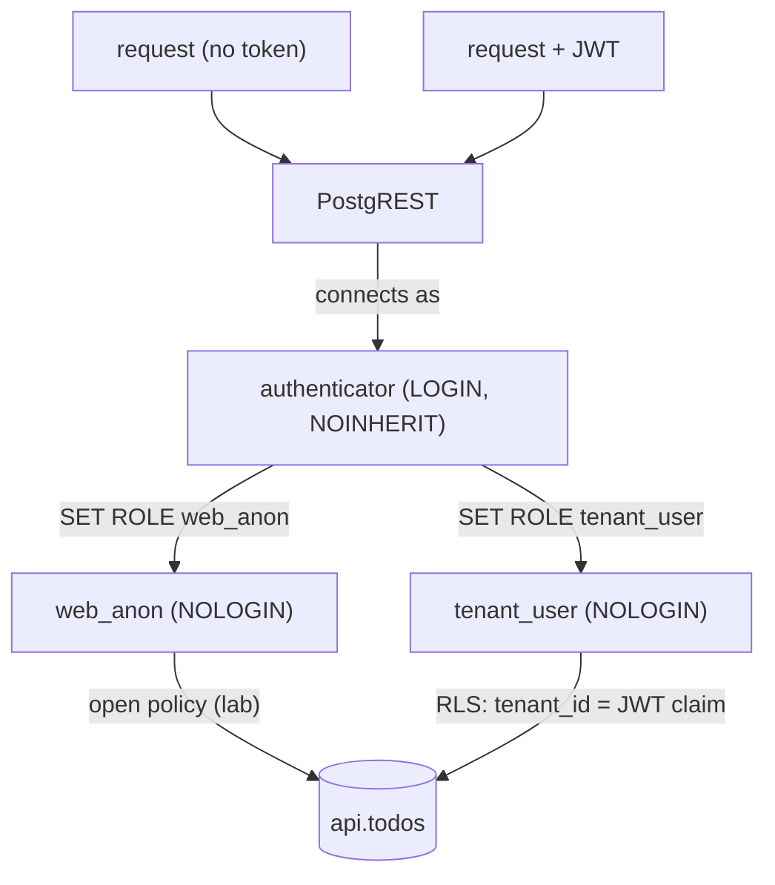

# Auth Model

**TL;DR:** Fixed login role + `SET ROLE` per request. Grants = HTTP verbs. Tenant from JWT, never from query.

Keywords: roles, RLS, JWT claims, tenant isolation.

## Roles

| Role            | Flags              | Purpose                                    |
| --------------- | ------------------ | ------------------------------------------ |
| `web_anon`      | `NOLOGIN`          | Anonymous API role, explicit open policy (lab) |
| `authenticator` | `NOINHERIT LOGIN`  | PostgREST connection role, member of both below |
| `tenant_user`   | `NOLOGIN`          | JWT-authenticated role, RLS-isolated per tenant |



- `NOINHERIT` → rights apply only after explicit `SET ROLE` per request (`PGRST_DB_ANON_ROLE`).
- Direct SQL login as `authenticator` = powerless by default.

## Grants (`migrations/000001_init.up.sql`)

```sql
GRANT USAGE ON SCHEMA api TO web_anon;
GRANT SELECT, INSERT, UPDATE, DELETE ON api.todos TO web_anon;
GRANT USAGE, SELECT ON ALL SEQUENCES IN SCHEMA api TO web_anon;
```

- Table grants ↔ HTTP verbs 1:1. `SELECT`-only → POST/PATCH/DELETE = `401`/`403`.
- Sequence grants ↔ `IDENTITY` keys. Missing → POST fails.
- `ALTER DEFAULT PRIVILEGES` → future sequences covered.
- Role creation in `DO` blocks → `migrate up` idempotent.

## Limitation

- `authenticator` password hardcoded in migration ↔ `AUTHENTICATOR_PASSWORD` in `.env`. Change both together.

## RLS: tenant isolation (`migrations/000002_tenant_rls`)

- `tenant_id INTEGER NOT NULL` on `api.todos`. RLS enabled, default-deny.
- `anon_full_access`: `web_anon` bypass (lab convenience, explicit).
- `tenant_isolation`: `tenant_user` sees/writes only rows where `tenant_id` = JWT `tenant_id` claim.
- JWT: `PGRST_JWT_SECRET` (≥32 chars, v16+ enforced). Payload `{"role":"tenant_user","tenant_id":1}`.
- Verified matrix: token T1 → tenant 1 rows only. Cross-tenant PATCH → `[]`. Cross-tenant INSERT → `42501`.
- Missing/invalid token → claim NULL → comparison NULL → deny. Fail-closed by default.
- Never trust client-supplied tenant. `tenant_id=eq.X` in URL = IDOR/BOLA by design.
- PII (email, tokens) never in query: URLs leak into logs/history. Use RPC/POST body.

## Multi-tenant patterns (R&D)

| # | Pattern | Enforcement | Portable | Leak on bug |
| - | ------- | ----------- | -------- | ----------- |
| 1 | App-level scoping (`WHERE tenant_id = ?` in code) | App (GORM scopes, Hibernate filters) | Yes | Yes, one forgotten filter |
| 2 | RLS (this project) | DB policy + JWT claims | Postgres-only | No, fail-closed |
| 3 | Schema per tenant (`SET search_path`) | DB namespace | Postgres-only | No, but migration fan-out |
| 4 | DB per tenant | Infrastructure | Yes | No, max ops cost |

- Rule of thumb: shared DB + `tenant_id` + enforce at lowest controlled layer.
- Best practice: defense in depth — app sends tenant (correctness) + RLS verifies (safety net).
- R&D next: RLS performance (`EXPLAIN` policy overhead), RLS + connection pooler (transaction mode vs `SET LOCAL`), per-tenant RLS benchmarks.
