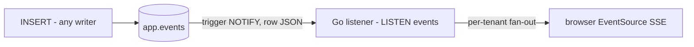

# Pipeline

**TL;DR:** Row in → trigger NOTIFYs JSON → Go LISTENs → Hub fans out per tenant → browser SSE.

Keywords: LISTEN/NOTIFY, fan-out, tenant routing.

## Stages

- **Write:** any Postgres writer (`POST /events`, psql, another service). Trigger fires on COMMIT; rolled-back writes never notify.
- **Notify:** `pg_notify('events', row_to_json(NEW))`. Payload = full row JSON.
- **Listen:** one dedicated connection (`pgx.Connect`, never pooled). Parses `tenant_id`, publishes raw payload.
- **Fan-out:** Hub routes by tenant to subscriber channels (buffered, drop-on-full).
- **Stream:** `GET /stream?tenant_id=N` → `text/event-stream`, 15s heartbeat, ctx cancel unsubscribes.

## Roles

- `POST /events` and `GET /stream` are separate concerns sharing only the Hub.
- Any writer works: the pipeline triggers off the table, not the endpoint.
