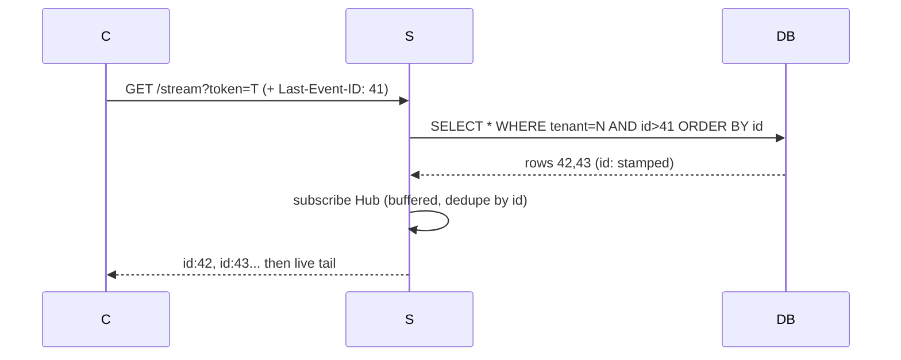

# Auth + resume — the stream grows up

> TL;DR: tenant from **JWT** (never query), events stamped **`id:`**,
> reconnects replay from **`Last-Event-ID`**. DB is the log, Hub is
> the wire — resume reads the log, live tails the wire.

## 1. Auth

- `POST /token {tenant_id}` mints a demo HS256 token (no expiry,
  no rotation — lab issuance, not a pattern).
- Writers use `Authorization: Bearer`. EventSource cannot set
  headers → `?token=` (short-lived, logged — accepted trade-off,
  see `network/auth/`).
- Tenant travels **only** in the token. `?tenant_id=` is gone:
  spoofing another tenant's stream now requires their key.

## 2. Resume

- Subscribe **before** replay: arrivals mid-replay buffer in the
  Hub channel and are deduplicated by `maxSent` — no gaps, no doubles.
- Every event exists in the DB first (insert → NOTIFY), so the
  replay window is infinite: slow subscribers lose live messages
  (Hub drops on full buffer) and recover them from the log.
- Heartbeat `: ping` every 15s + `X-Accel-Buffering: no` per the
  SSE lab's header rules.

## 3. What changed (files)

- `internal/auth/` — stdlib HS256 verify/mint, `RequireTenant`.
- `internal/delivery/http.go` — protected routes, replay + live tail.
- `web/index.html` — token mint on tenant change, `?token=` stream.
