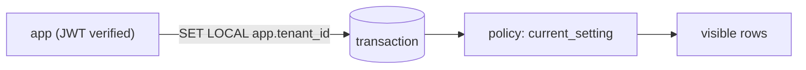

# How RLS Works

**TL;DR:** `ENABLE ROW LEVEL SECURITY` + policies = per-row `WHERE` the database enforces itself. Default-deny; no policy match = no rows.

Keywords: USING, WITH CHECK, fail-closed, SET LOCAL.

## Core model

```
Query --> RLS policy check --> rows (or nothing)
```

- RLS off: query sees all rows grants allow (statement-level privileges only).
- RLS on: every row passes policy expressions first. No match → invisible (reads) or rejected (writes).

## Policy anatomy

```sql
CREATE POLICY tenant_isolation ON lab.documents
    FOR ALL TO lab_user
    USING (tenant_id = lab.current_tenant())
    WITH CHECK (tenant_id = lab.current_tenant());
```

- `FOR ALL` = SELECT + INSERT + UPDATE + DELETE. Narrow with `FOR SELECT` / `FOR INSERT` etc. when roles differ.
- `TO lab_user` = only this role is filtered. Other roles (and owners) unaffected.
- `USING` = filter on **existing** rows (read/update/delete visibility).
- `WITH CHECK` = constraint on **new/modified** rows (insert/update). Violation → `42501`.
- Cross-tenant UPDATE matches 0 rows (silent deny, leaks nothing). Cross-tenant INSERT fails loud (`42501`).

## Tenant context plumbing

Policies can't see HTTP/JWT. Context arrives via session settings:



- `SET LOCAL` = transaction-scoped. Commit/rollback wipes it. Pool-safe by construction.
- `SET` (session-scoped) on pooled connections = tenant leak. Never use it for tenant context.
- `current_setting('app.tenant_id', true)` = read back; `true` means missing → NULL, not error.
- NULL claim → `tenant_id = NULL` → false → deny. Fail-closed, no special casing.

## Bypass rules (who ignores RLS)

- Table **owners** and **superusers** bypass all policies, always.
- Consequence: test policies as the app role (`SET ROLE lab_user`), never as admin.
- `BYPASSRLS` attribute can exempt specific roles; default off, keep it off.

## Policy in the plan

- Policy inlines as a plain qual (`Filter` or `Index Cond`). Optimizer understands it.
- `current_setting` is `STABLE`: evaluated once per query, not per row. Overhead ≈ 0.
- Right index absorbs the policy entirely (see lab 05: composite `(tenant_id, id)` → no Filter node).
