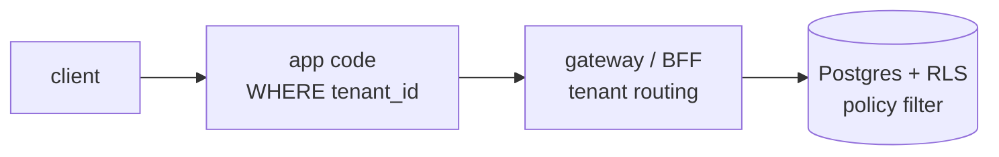

# Architecture RLS Solves

**TL;DR:** Shared tables + N tenants + one API surface. RLS pushes tenant isolation to the layer closest to the data.

Keywords: shared-DB multi-tenancy, enforcement point, defense in depth.

## Problem shape

```
                ┌── tenant 1 rows ──┐
1 table ────────┼── tenant 2 rows ──┤── 1 API ──▶ N tenants
                └── tenant N rows ──┘
```

One dataset, many mutually blind tenants, single query path. The question is only **where the blindness is enforced**.

## Enforcement points (outside-in)



| Layer        | Enforces via                   | Fails when                         |
| ------------ | ------------------------------ | ---------------------------------- |
| App code     | Hand-written `WHERE` per query | One forgotten filter               |
| Gateway/BFF  | Route + token claims           | Logic duplicated per service       |
| Postgres RLS | Policy per table/role          | Misconfigured policy, owner bypass |

Each outer layer is convenience; the innermost holding layer is safety.
Bugs shrink inward: app bug leaks unless DB says no.

## Placement rule

- Enforce at the **lowest layer you control**. Own the DB → RLS. Only own the app → disciplined scoping + review.
- Never enforce at the client (query params, headers). Client input is attacker input.
